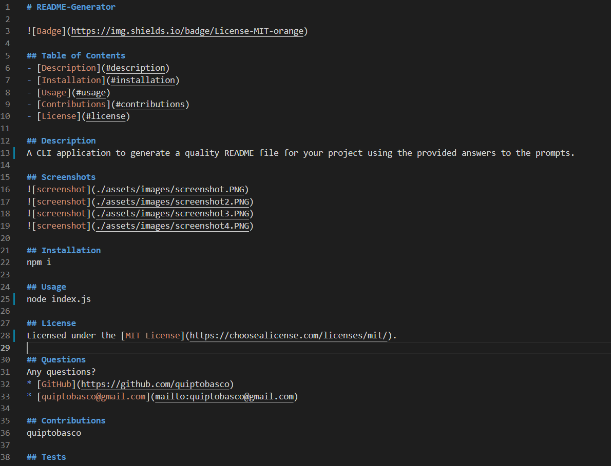

# README-Generator

## Table of Contents
- [Description](#description)
- [Installation](#installation)
- [Usage](#usage)
- [Contributions](#contributions)
- [License](#license)

## Description
A CLI application to generate a quality README filr for your project using the provided answers to the prompts.

## Screenshots

## Installation
npm i

## Usage
node .\index.js

## License 
Licensed under the [MIT License](https://choosealicense.com/licenses/mit/) license.

## Questions
Any questions?
* [GitHub](https://github.com/quiptobasco)
* [quiptobasco@gmail.com](mailto:quiptobasco@gmail.com)

## Contributions
quiptobasco

## Tests

